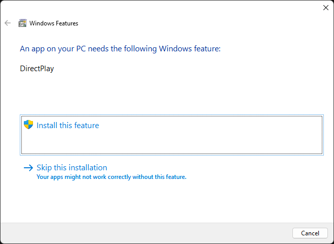
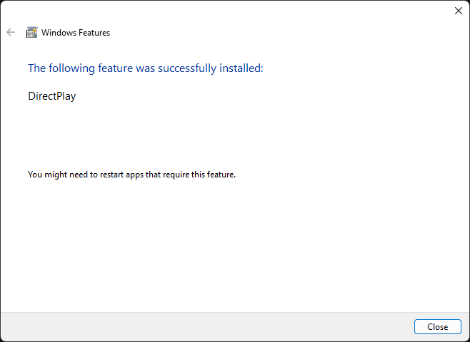

# DirectPlay
NSPW 1.22 (`Nspw122/NSPW_122.exe`) needs the DirectPlay Windows feature. DirectPlay is a legacy DirectX component that is not installed by default on Windows 8 and later, including Windows 11.

## Symptom
The first time `NSPW_122.exe` is launched on a system without DirectPlay, Windows shows the following dialog instead of starting the game:



## Installing DirectPlay
Any of the following methods works. All of them require administrator rights.

### From the dialog
Click **Install this feature** and approve the UAC prompt. Windows downloads and enables DirectPlay, then confirms the installation:



Click **Close** and start the game again.

Clicking **Skip this installation** dismisses the dialog, but the game will not run correctly.

### From Windows Features
1. Press <kbd>Win</kbd> + <kbd>R</kbd>, enter `optionalfeatures`, and press <kbd>Enter</kbd>.
2. Expand **Legacy Components** and check **DirectPlay**.
3. Click **OK** and wait for the installation to finish.

### From the command line
In an elevated PowerShell:

```powershell
Enable-WindowsOptionalFeature -Online -FeatureName DirectPlay -All
```

Or in an elevated Command Prompt:

```bat
dism /online /enable-feature /featurename:DirectPlay /all
```

To check whether DirectPlay is already enabled:

```powershell
Get-WindowsOptionalFeature -Online -FeatureName DirectPlay
```
