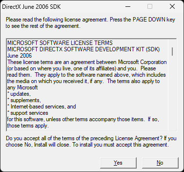
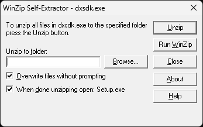
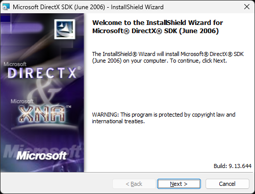
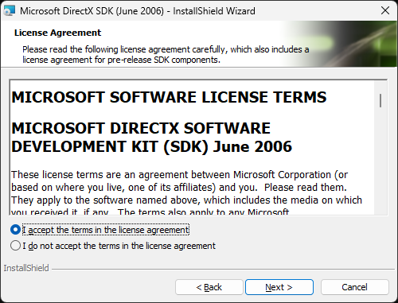
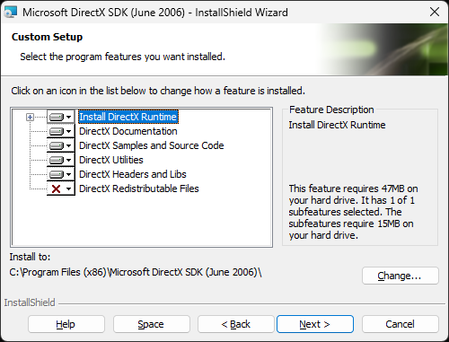
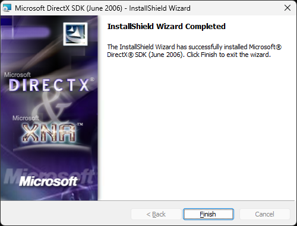
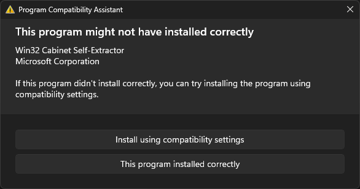

# DirectX SDK (June 2006)
Building the NSPW NET source (`NSPW_NET/`) requires the DirectX SDK (June 2006). The project's include paths point to it, and it provides headers and libraries that are not part of the Windows SDK, such as D3DX9 (`d3dx9.h`), `dxerr9.h` and DirectPlay 8 (`dplay8.h`, `dplobby8.h`, `dpaddr.h`).

## Downloading
Microsoft no longer hosts DirectX SDK releases from 2007 and earlier. The installer (`dxsdk_jun2006.exe`, 443 MB) is archived on the [Internet Archive](https://archive.org/details/dxsdk_jun2006).

Before running it, check that it is signed by Microsoft. In PowerShell:

```powershell
Get-AuthenticodeSignature "$env:USERPROFILE\Downloads\dxsdk_jun2006.exe" | Format-List Status, SignerCertificate
```

`Status` should be `Valid`, and the signer should be Microsoft Corporation.

## Installing
1. Run `dxsdk_jun2006.exe` and accept the license agreement.

    

2. The WinZip self-extractor unpacks the actual installer (`dxsdk.exe`). Enter or browse to a folder to unzip to, keep **When done unzipping open: Setup.exe** checked, and click **Unzip**.

    

3. When the InstallShield Wizard starts, click **Next**.

    

4. Accept the license agreement and click **Next**.

    

5. Keep the default features. **DirectX Headers and Libs** is the one required to build NSPW NET. The default install location on 64-bit Windows is `C:\Program Files (x86)\Microsoft DirectX SDK (June 2006)\`. Click **Next** to install.

    

6. Click **Finish**.

    

7. Windows may then show the Program Compatibility Assistant. The 2006 installer does not report its result in a way Windows recognizes, so this dialog appears even when the installation succeeded. Click **This program installed correctly**.

    

## Verifying
The installer sets the `DXSDK_DIR` environment variable to the install location. The following should exist:

- `Include\d3dx9.h`, `Include\dxerr9.h`, `Include\dplay8.h`, `Include\dplobby8.h`, `Include\dpaddr.h`
- `Lib\x86\d3dx9.lib`, `Lib\x86\dxerr9.lib`, `Lib\x86\dxguid.lib`

The NSPW NET project hard-codes `C:\Program Files\Microsoft DirectX SDK (June 2006)\Include`, which does not match the default install location on 64-bit Windows. Point the include and library paths at `$(DXSDK_DIR)Include` and `$(DXSDK_DIR)Lib\x86` instead.
