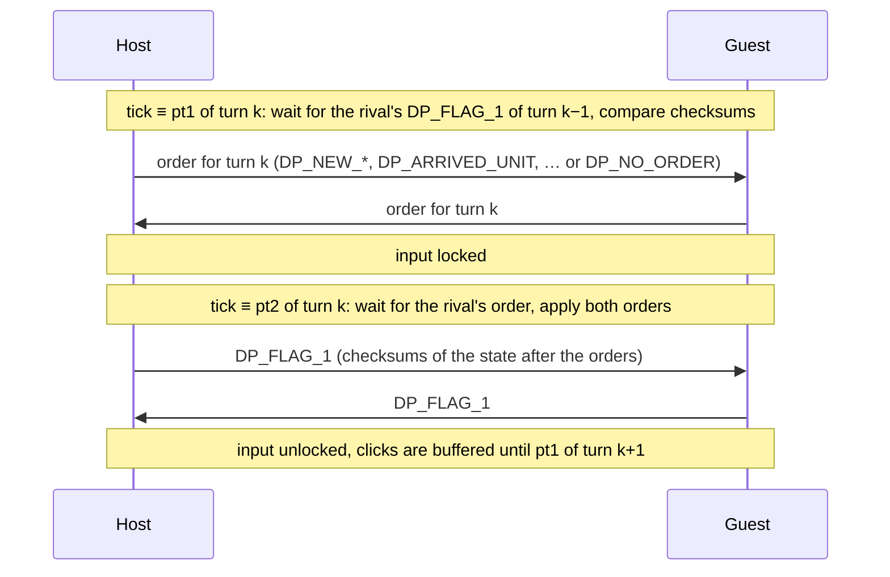

# Synchronization
How NSPW NET keeps the two players' games in sync. Everything here was read from the source in [`NSPW_NET`](../../NSPW_NET). Line links point to the relevant code.

## Summary
NSPW NET uses **deterministic lockstep**. Each peer runs the full simulation of both sides. The only thing sent during a battle is each player's **orders**, at most one per turn. Both peers apply the same orders at the same simulation tick and draw from the same seeded `rand()` sequence, so they compute identical results without ever sending unit positions. Each turn, the peers also exchange small checksums to detect a desync. They do not recover from one: the game shows a warning and players restart from an autosave.

- Topology: two peers, one host and one guest (DirectPlay 8 peer-to-peer, `dwMaxPlayers = 2`).
- Transport: DirectPlay 8 guaranteed sends, which are delivered reliably and in order.
- Authority: the host chooses the scenario, settings and random seed before the battle. During the battle neither peer is authoritative; the peers are symmetric.

## Session setup (DirectPlay 8)
| Item | Value | Source |
| --- | --- | --- |
| Interface | `IDirectPlay8Peer`, with an `IDirectPlay8ThreadPool` set to 0 threads ("DoWork" mode) | [win_main.cpp:662](../../NSPW_NET/win_main.cpp#L662) |
| Application GUID | `{011BC0EB-BDB3-11D6-BA95-9CCE36897055}` | [win_main.cpp:89](../../NSPW_NET/win_main.cpp#L89) |
| Default port | 2310 (`ADDRESSOVERRIDE_PORT`) | [all_head.h:468](../../NSPW_NET/all_head.h#L468) |
| Session flags | `DPNSESSION_NODPNSVR`, no session name, `dwMaxPlayers = 2` | [dplay.cpp:938](../../NSPW_NET/dplay.cpp#L938) |
| Joining | The guest calls `Connect` directly with the host's address. There is no session enumeration. | [dplay.cpp:1017](../../NSPW_NET/dplay.cpp#L1017) |
| Player name | `SetPeerInfo` with `DPNINFO_NAME` | [dplay.cpp:931](../../NSPW_NET/dplay.cpp#L931) |

DirectPlay is pumped with `DoWork(8 ms)` once per iteration of the main loop ([win_main.cpp:1012](../../NSPW_NET/win_main.cpp#L1012)). The message handler [`DirectPlayMessageHandler`](../../NSPW_NET/dplay.cpp#L1065) therefore always runs on the main thread, between frames, and needs no locking. On `DPN_MSGID_CREATE_PLAYER`, the non-local player's `DPNID` becomes `g_dpnidRivalPlayer`. Every later send is a `SendTo` to that one player.

Before the game window opens, a modeless dialog loop waits for the connection ([win_main.cpp:712](../../NSPW_NET/win_main.cpp#L712)). Once two players are connected, the host clicks **Start**, which sends `MSG_EXIT_WAITING` so that the guest's dialog closes too.

## Message format
Each message is a raw C struct packed to 1 byte (`#pragma pack(1)`), little-endian, with x86 sizes (`short` = 2, `BOOL` = 4). The first `DWORD` is the message type. Definitions are in [all_typedef.h:150](../../NSPW_NET/all_typedef.h#L150) and the type IDs in [all_head.h:484](../../NSPW_NET/all_head.h#L484). The receiver casts the buffer to the struct for that type and copies the fields into globals ([dplay.cpp:1259](../../NSPW_NET/dplay.cpp#L1259)). It does not check the received size.

Two send modes are used ([all_head.h:526](../../NSPW_NET/all_head.h#L526)):

- `MUST_SEND` = `DPNSEND_GUARANTEED | DPNSEND_NOLOOPBACK`: reliable and in order. Used for everything that matters.
- `EASY_SEND` = `DPNSEND_NOCOMPLETE | DPNSEND_NOLOOPBACK`: not guaranteed. Used only for status that is resent periodically on the menu screens.

### Messages before the battle
| Type | ID | Struct (bytes) | Direction | Mode | Meaning |
| --- | --- | --- | --- | --- | --- |
| `MSG_EXIT_WAITING` | 1 | `_GENERICMSG` (4) | host → guest | must | Close the connection dialog. |
| `RIVAL_MODE` | 500 | `_DP_FLAG` (10) | both | easy | Sender's current screen (`mode`), every 40 frames. |
| `RIVAL_VER` | 501 | `_DP_DATA_20` (264) | both | easy | Version string (`"1.10"`), every 40 frames. Only displayed, not enforced. |
| `GO_GAME_SETTING` | 6 | `_DP_FLAG` (10) | host → guest | must | Go to the scenario settings screen. |
| `SIDE_AND_SINARIO` | 5 | `_DP_DATA_1` (40) | host → guest | easy | Current settings, every 10 frames, for the guest's display. |
| `USER_SINARIO_FN` | 11 | `_DP_DATA_20` (264) | host → guest | must | File name of a user scenario. Only the name is sent; the guest must have the same file. |
| `OUT_GAME_SETTING` | 4 | `_DP_DATA_1` (40) | host → guest | must | Settings confirmed; go to the configuration screen. |
| `OUT_SETUP` | 3 | `_DP_DATA_1` (40) | host → guest | must | `data[0]` = random seed. |
| `OUT_CNFG_SETTING` | 7 | `_DP_DATA_1` (40) | host → guest | must | Final settings; start the battle. |
| `START_IN_RESUME` / `START_IN_AUTOSAVE` | 9 / 10 | `_DP_DATA_1` (40) | host → guest | must | Start the battle from a saved state. |

The settings in `_DP_DATA_1.data[0..9]` are: host side, scenario, supply rate (host, guest), victory-decision switch, initial supply points (host, guest), reinforcement arrival, side-reversal time, side-reversal rule.

### Messages during the battle
| Type | ID | Struct (bytes) | Meaning |
| --- | --- | --- | --- |
| `DP_NO_ORDER` | 15 | `_DP_FLAG` (10) | No order this turn. |
| `DP_NEW_PP` / `_SHIP` / `_PLANE` | 20 / 21 / 22 | 103 / 53 / 63 | Move order: leader unit `used`, waypoint `x`, `y` (`short`), `cls` (replace the route instead of appending), and the selection. |
| `DP_NEW_SLCT` / `_SHIP` / `_PLANE` / `_LAND` | 30 / 31 / 32 / 33 | 104 / 54 / 64 / 14 | Target order: attack unit `m`, assign planes to carrier or airfield `m`, or set a landing point (`gr_x`, `gr_y`) for a transport (`m` = 0). |
| `DP_NEW_MENU` | 40 | `_DP_NEW_MENU` (96) | Command-menu order (move, return, supply, arm torpedoes or bombs, and so on). |
| `DP_ARRIVED_UNIT` | 60 | `_DP_DATA_1` (40) | Reinforcement request: `data[0]` = unit kind + 1. |
| `GO_GAME_SETTING` / `RESUME_AND_GO_GAME_SETTING` | 6 / 8 | `_DP_FLAG` (10) | End the battle (and save for resuming). Sent as that turn's order. |
| `DP_FLAG_1` | 50 | `_DP_FLAG` (10) | End-of-turn checksums; see [Desync detection](#desync-detection). |
| `DP_CHAT_1` | 100 | `_DP_DATA_20` (264) | Chat. Not part of the lockstep. |

The selection is a 90-byte array relative to the sender's own side: bytes 0–39 are the sender's ships, bytes 40–89 its planes. Each nonzero value is the unit's position in the selection order, which becomes its wingman number. The `_SHIP` and `_PLANE` variants send only the part that is in use. The receiver converts the array to absolute unit numbers based on the sender's side ([chara_cont.cpp:496](../../NSPW_NET/chara_cont.cpp#L496)). Unit numbers are: Japanese ships 1–40, US ships 41–80, Japanese planes 81–130, US planes 131–180 ([all_head.h:445](../../NSPW_NET/all_head.h#L445)).

## Simulation tick
The simulation advances one **tick** per call of [`chara_cont`](../../NSPW_NET/chara_cont.cpp#L28), counted by `cc_count`. [`updateFrame`](../../NSPW_NET/win_main.cpp#L284) calls it `game_speed` times per frame. At speed 1, frames are throttled to one per ~50 ms ([win_main.cpp:311](../../NSPW_NET/win_main.cpp#L311)), which gives about 20 ticks per second. At higher speeds there is no throttle. Each player sets their own speed with <kbd>F</kbd>/<kbd>G</kbd>/<kbd>R</kbd> (or holds <kbd>Space</kbd>), and the faster peer simply waits for the slower one.

`updateFrame` runs only while the game window is active and no dialog is open ([win_main.cpp:995](../../NSPW_NET/win_main.cpp#L995)). Switching away from the game, or opening the chat or a confirmation dialog, stops that peer's simulation, and the other peer then stalls waiting for it.

## Lockstep turn
Turns are `cnct_loop` ticks long. Two ticks in each turn are synchronization points, `cnct_loop_pt1` and `cnct_loop_pt2`:

| Start | `cnct_loop` | `pt1` | `pt2` | Turn at speed 1 | Source |
| --- | --- | --- | --- | --- | --- |
| New battle | 20 | 6 | 13 | ~1 s | [cnct_game_cont.cpp:5085](../../NSPW_NET/cnct_game_cont.cpp#L5085) |
| Resume or autosave | 30 | 8 | 19 | ~1.5 s | [cnct_game_cont.cpp:4814](../../NSPW_NET/cnct_game_cont.cpp#L4814) |

Both sync points are at the top of `chara_cont`, before the tick does any simulation. If a peer reaches one without the message it needs, `chara_cont` returns without incrementing `cc_count`. The simulation is frozen, but drawing and DirectPlay keep running, and the next frame retries.

### Input
Clicks in the battle never change the simulation directly. [`cnct_game_input_cont`](../../NSPW_NET/input.cpp#L30) and the menu code in `unit_info_cont` copy the local order into the `bf_*[1]` buffers (index 1 is always the local player and index 0 the rival). Buffering an order clears `you_can_order`, so **each player can give one order per turn**, and further clicks are ignored until the turn's orders have been applied. Selecting units only changes local state and is sent with the next order.

### At `pt1`: send the order ([chara_cont.cpp:73](../../NSPW_NET/chara_cont.cpp#L73))
1. Wait until `go_next_1` is set, that is, until the rival's `DP_FLAG_1` for the previous turn has arrived.
2. Increment `rest_time` (game time, counted in turns) and swap the supply rates if the side-reversal time has been reached.
3. Compare the rival's checksums with the local ones from the previous `pt2`.
4. Send the buffered order, or `DP_NO_ORDER`. If several kinds were buffered, the first in this list wins: system menu, reinforcement, move, target, command menu.
5. Lock input (`you_can_order = 0`).

### At `pt2`: apply the orders ([chara_cont.cpp:395](../../NSPW_NET/chara_cont.cpp#L395))
1. Wait until `go_next_2` is set, that is, until the rival's order for this turn has arrived. While waiting, count the stalled ticks in `ccc_wait[1]`.
2. Increment the autosave counter and handle a system-menu order (end the battle).
3. Spawn reinforcements, US side first and then Japanese side on both peers ([chara_cont.cpp:444](../../NSPW_NET/chara_cont.cpp#L444)). Without a fixed order, the new units would get different slot numbers on each peer.
4. Copy both players' orders into `new_pp[0..1]`, `new_slct[0..1]` and `slct_unit[0..1]`, and apply them with [`cnct_game_input_now`](../../NSPW_NET/input.cpp#L795) and [`cnct_unit_info_cont_now`](../../NSPW_NET/unit_info_cont.cpp#L1556). These set waypoints, formations, targets and modes on the units.
5. Clear the buffers and unlock input.
6. Compute the checksums and send `DP_FLAG_1` ([chara_cont.cpp:613](../../NSPW_NET/chara_cont.cpp#L613)).

The rest of the tick (`find_out`, `cc_count++`, clouds, units, fire) then runs as usual.

### Pipeline and latency
The first `pt1` needs a `DP_FLAG_1` that was never sent at a `pt2`, so [`cnct_game_init`](../../NSPW_NET/cnct_game_cont.cpp#L5052) sends one with zeroed checksums to start the pipeline.

A peer cannot pass `pt2` of turn *k* until the rival has passed `pt1` of turn *k*, and cannot pass `pt1` of turn *k*+1 until the rival has passed `pt2` of turn *k*. The peers therefore stay within about half a turn of each other. For the same reason, at most one order and one `DP_FLAG_1` from the rival can be in flight at once, which is why a single global per message type works as the receive buffer.

For a new battle at speed 1:

- An order takes effect 7 to 20 ticks (about 0.35–1 s) after the click, depending on where in the turn it was given.
- The simulation does not stall while the one-way network delay stays below `pt2 − pt1` = 7 ticks (about 350 ms). Beyond that, both peers stall at `pt2` every turn.

`ccc_wait` was meant to let a peer that keeps waiting speed itself up, but that code is commented out ([chara_cont.cpp:153](../../NSPW_NET/chara_cont.cpp#L153)).

## Determinism
Lockstep works only if both peers compute exactly the same state from the same orders. NSPW NET gets this as follows:

- **Same start**: the same scenario data and settings (sent by the host), the same executable, and the same random seed.
- **Shared random sequence**: [`rnd(x)`](../../NSPW_NET/etc3.cpp#L61) is `rand() % x` and increments `rnd_count`. At the start of a battle, both peers call `srand(cnct_game_rnd_sheed)` ([cnct_game_cont.cpp:4708](../../NSPW_NET/cnct_game_cont.cpp#L4708)). The host generated the seed with `srand(time(NULL)); rnd(65536)` and sent it in `OUT_SETUP` ([demo.cpp:2025](../../NSPW_NET/demo.cpp#L2025)). `rand()` is the MSVC CRT generator. Because DirectPlay callbacks run on the main thread, only the main thread calls it.
- **Separate cosmetic random sequence**: [`my_rnd(x)`](../../NSPW_NET/etc3.cpp#L47) reads from a 4096-entry table filled from `rnd()` at the start ([etc3.cpp:31](../../NSPW_NET/etc3.cpp#L31)). Drawing code also calls it, depending on what is on screen, so its position differs between peers. It is used only for effects, sounds, and the position of planes parked on deck.
- **Symmetric code**: visibility (`find_out`) is computed for both sides on each peer, in unit-number order, so its result does not depend on which side is local.
- **Same order of operations**: units, fire and effects are fixed-size arrays processed in index order.
- **Same floating point**: both peers run the same x86 build on the x87 FPU, so `double` arithmetic and `sin`, `cos` and `atan2` give the same results.

## Desync detection
At each `pt2`, after the orders are applied, each peer computes three 1-byte checksums, keeps them in `bf_*[1]`, and sends them in `DP_FLAG_1` ([chara_cont.cpp:613](../../NSPW_NET/chara_cont.cpp#L613)):

| Field | Value | Detects |
| --- | --- | --- |
| `cc_chk` | `cc_count` mod 256 | Peers at different ticks ("program sync error") |
| `unit_chk` | `(BYTE) Σ (int)((x + y + drctn) × 10000)` over the units in use, except parked planes | Different positions or headings ("unit data sync error") |
| `rnd_chk` | `rnd_count` mod 256 | A different number of `rand()` calls ("random sync error") |

Parked planes are left out ([chara_cont.cpp:626](../../NSPW_NET/chara_cont.cpp#L626)) because their position is set with `my_rnd`, which differs between peers.

At the next `pt1`, a mismatch sets `unit_out`, `ccc_out` or `rnd_out`, and the game shows a red warning telling the players to stop ([win_main.cpp:469](../../NSPW_NET/win_main.cpp#L469)). On the first mismatch, the peer saves its state to `Saved\cnct_error.dat` for debugging. The game keeps running and does not try to resynchronize.

## Saving and resuming
[`save_on_resume`](../../NSPW_NET/cnct_game_cont.cpp#L27) writes the `unit`, `fire` and `effect` arrays and some globals to a file. Each peer writes its own file at the same tick, so the files contain the same battle state:

- `Saved\auto_save.dat`: every 90 turns ([chara_cont.cpp:407](../../NSPW_NET/chara_cont.cpp#L407)). Autosaving stops after the first desync, so the last autosave holds a state from before it.
- `Saved\resume_1.dat`: when a player ends the battle with the resume option.

When the host starts from either file (`START_IN_RESUME` or `START_IN_AUTOSAVE`), each peer loads its own copy. No state is sent over the network. The random generator is reseeded with the last seed received in this session, or 0 after a fresh launch; both peers have the same value either way. The turn becomes 30 ticks long and `cc_count` restarts at 0. This is how players recover from a desync: return to the menu and start again from the autosave.

## Known weaknesses
- **Order of applying orders.** `cnct_game_input_now` and `cnct_unit_info_cont_now` apply index 0 (the rival) before index 1 (the local player). Each peer therefore applies the two players' orders in a different order. That is harmless as long as the two orders touch different units and do not use the shared random sequence. However, [`set_pos_of_dynmc`](../../NSPW_NET/etc1.cpp#L2619) calls `rnd()` when planes are ordered to follow a ship, so if both players give such an order in the same turn, the two peers draw the random numbers in a different order. By reading the code, this should cause a desync. Reinforcements avoid the problem with a fixed order (see step 3 of `pt2`).
- **The sender applies its own buffer, not the message.** The local order keeps `x` and `y` as `double`, while the message truncates them to `short`. This only works because the map coordinates of a click happen to be integers.
- **Weak checksums.** 8 bits each, and positions are summed, so some desyncs go undetected for a while.
- **Everything is trusted.** Each peer knows the full state, so a modified client could reveal hidden units. Reinforcement requests are not checked against the sender's supply points, which only the sender tracks. Received messages are not size-checked, and chat text is passed to `wsprintf` as a format string with a 128-byte buffer.
- **One order per turn**, with up to a second of input delay.
