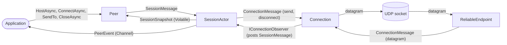
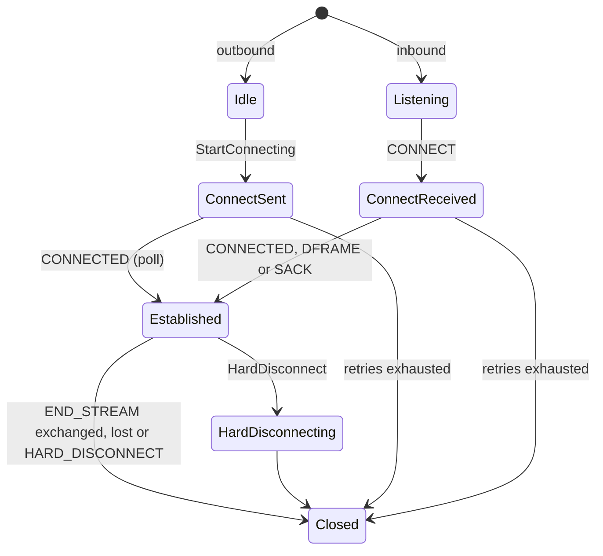

# Aigamo.Otsuki

A DirectPlay 8 peer (`IDirectPlay8Peer`) for .NET, built on the messages of [Aigamo.Otsuki.Messages](../Aigamo.Otsuki.Messages). It speaks the wire protocol of DirectX 8/9 DirectPlay over UDP:

* [[MC-DPL8R]: DirectPlay 8 Protocol: Reliable](https://docs.microsoft.com/en-us/openspecs/windows_protocols/mc-dpl8r/7a35d96c-daca-4311-bc2b-bd6a2f50bf14) – connections, sequencing, acknowledgments and retries on top of UDP.
* [[MC-DPL8CS]: DirectPlay 8 Protocol: Core and Service Providers](https://docs.microsoft.com/en-us/openspecs/windows_protocols/mc-dpl8cs/2968b3eb-a248-4281-b718-8a7d55fd9b36) – sessions, players and the name table.

Sessions form a full peer mesh: one peer hosts, hands out player IDs (DPNIDs) and owns the name table, and every peer that joins is connected to directly by all the others.

## Usage

```csharp
await using var peer = new Peer();
peer.SetPeerInfo("Alice");

var application = new ApplicationDescription { GuidApplication = guidApp, MaxPlayers = 2 };
await peer.HostAsync(application);                                    // or:
await peer.ConnectAsync(application, "192.168.0.10", Peer.DefaultPort);

peer.SendTo(Peer.AllPlayers, data, SendFlags.Guaranteed | SendFlags.NoLoopback);
```

Notifications arrive as `PeerEvent`s, a union of `PlayerCreated`, `PlayerDestroyed`, `DataReceived`, `ConnectCompleted`, `SendCompleted` and `SessionTerminated`. Consume them in one of two ways, not both:

```csharp
// Polling, once per frame of a game loop, like IDirectPlay8ThreadPool::DoWork:
peer.DoWork(e => e.Match(
	PlayerCreated: created => /* created.Player.Name */,
	PlayerDestroyed: destroyed => /* destroyed.Player, destroyed.Reason */,
	DataReceived: received => /* received.Sender, received.Data */,
	ConnectCompleted: completed => /* completed.Result */,
	SendCompleted: completed => /* completed.Handle, completed.Result */,
	SessionTerminated: terminated => /* terminated.Result */
));

// Or streaming:
await foreach (var e in peer.ReadEventsAsync()) { /* ... */ }
```

[Aigamo.Otsuki.ConsoleApp](../Aigamo.Otsuki.ConsoleApp) is a complete example: a chat in which one peer hosts and the others join.

## Design

### Why actors

A DirectPlay peer reacts to three independent sources at once: datagrams arriving on the socket, timers firing (retries, delayed acknowledgments, keep-alives, time-outs), and the application calling `SendTo`, `HostAsync` and so on. All three change the same protocol state. The classic answer is locks around that state, which is how the previous implementation did it, with about seven lock objects and `Monitor.Wait`/`PulseAll`. That is hard to get right and harder to change.

Otsuki uses the actor model instead. Every piece of protocol state belongs to exactly one actor, and nothing else ever touches it. The other threads interact with an actor only by posting a message to its mailbox, and the actor handles its messages one at a time. Each handler therefore reads like plain sequential code, with no locks, no races between a timer and a receive, and no state changing underneath it.

### The actor

[`Actor<TMessage>`](Actors/Actor.cs) is deliberately small:

* A mailbox: an unbounded `System.Threading.Channels.Channel<TMessage>` with a single reader.
* A message loop that reads the mailbox and calls `Receive(message)` for each message, one after the other.
* `Post(message)`, which only enqueues and is safe to call from any thread. It returns `false` once the actor has stopped.

A few rules keep this sound:

* **Handlers never block and never await.** They update state, post messages to other actors, send datagrams (a UDP send does not block) and return.
* **Messages are immutable records.** Whatever crosses an actor boundary can be read safely by the receiver.
* **Timers only post.** [`ActorTimer`](Actors/ActorTimer.cs) wraps a `TimeProvider` timer whose callback posts a message carrying a generation number. Rescheduling or canceling bumps the generation, so a firing that was already on its way is recognized as stale and dropped (`TryConsume`). No timer callback ever touches state.
* **Other threads read snapshots.** When the application needs to read state, as with `GetPeerInfo` or `Players`, the session publishes an immutable `SessionSnapshot` that the facade reads with `Volatile.Read`. No reader ever sees the actor's mutable state.

### The actors and how messages flow



* [`Peer`](Peer.cs) is the facade the application uses. Its methods turn calls into `SessionMessage`s and post them. Calls that need an answer (`HostAsync`, `ConnectAsync`, `CloseAsync`) carry a `TaskCompletionSource` that the session completes.
* [`SessionActor`](Session/SessionActor.cs) runs the core protocol ([MC-DPL8CS]): the name table, joining and leaving, integrity checks, and routing application data to and from players. It raises `PeerEvent`s into a channel that the application drains.
* [`ReliableEndpoint`](Reliable/ReliableEndpoint.cs) owns the UDP socket and the connection table. It decodes each datagram and forwards it to the `Connection` for its source address, creating one for a new CONNECT.
* [`Connection`](Reliable/Connection.cs) is one connection of the reliable protocol ([MC-DPL8R]) to one remote address, so there is one actor per partner. It reports to the session through `IConnectionObserver`, which the session implements by posting to its own mailbox. For any one connection, the session receives its notifications in order.

For example, a chat message from another peer travels: socket receive loop → `ReliableEndpoint` (decode, look up the connection) → `Connection` (sequence, acknowledge, reassemble) → `SessionActor` (map the connection to a player) → `PeerEvent.DataReceived` → the application.

### State machines

`Connection` and `SessionActor` are state machines:

* The state is a union, a `[GenerateMatch]` abstract record whose cases are the states: [`ConnectionState`](Reliable/ConnectionState.cs) and [`SessionState`](Session/SessionState.cs). Data that only matters in one phase lives on that case. For example, `ConnectionState.Established` holds the [`ReliableChannel`](Reliable/ReliableChannel.cs) that does the sequencing, and `SessionState.Joining` holds the join progress.
* Each case lists the transitions it allows by implementing transition interfaces such as `ICanAcceptConnect`, `ICanRetransmit`, `ICanAdmitPlayers` and `ICanCompleteJoining`. They live one per file in the `Transitions` folders.
* A transition handles one or more message types in a default interface implementation of `Execute(actor, message)`, which returns the next state.
* For each message, the actor checks whether its current state implements the transition for that message type. If it does, the actor runs it and stores the returned state. If it does not, the message is ignored, which is what the protocol specifications require of unexpected packets.

The connection's states follow [MC-DPL8R] section 3.1, figure 1:



The session's states are `Idle`, `Hosting`, `Connecting` (waiting for DN_SEND_CONNECT_INFO), `Joining` (in the name table, waiting for the established peers to connect), `Connected`, `Terminated`, `Closing` and `Closed`.

Every dispatch over a union (mailbox messages, wire messages, peer events) uses the `Match` that [Aigamo.MatchGenerator](https://github.com/ycanardeau/MatchGenerator) generates, so adding a case is a compile error until every `Match` handles it. Fallible steps such as validating a join or parsing a DirectPlay URL return [Aigamo.Results](https://github.com/ycanardeau/Results) values instead of throwing.

### Threading summary

| Code | Runs on |
| --- | --- |
| `Peer` methods | the caller's thread; they only post |
| `SessionActor`, each `Connection`, `ReliableEndpoint` | one message at a time, on the thread pool |
| Timer callbacks, the socket receive loop | the thread pool; they only post |
| `DoWork` handlers | the thread that calls `DoWork` |
| `ReadEventsAsync` consumers | wherever the consumer awaits |

There are no locks anywhere in the library. The only cross-thread primitives are the channels, one `Interlocked.Increment` for send handles, and the `Volatile` snapshot.

## Testing

Everything that touches the network goes through `IDatagramTransport`, and all timing through `TimeProvider`. The tests run peers over an in-memory network that can lose, delay, reorder and partition datagrams, and use short protocol timings. They cover meshes of up to six peers, 20% packet loss with reordering, messages larger than a frame, peers leaving or dropping off, the host leaving, and rejected joins. Protocol tests replay the sample packets from [MC-DPL8R] section 4 byte for byte, and one test runs two peers over real loopback UDP.

## Limitations

* No host migration: when the host leaves, the session terminates for everyone else.
* No groups, no updating player info after joining, no host enumeration (`EnumHosts`) and no DPNSVR.
* No packet signing. Coalesced payloads are understood on receipt but never sent.
* Not yet tested against real DirectPlay. The bit order of the send mask, which tells a receiver that lost unreliable frames will not be resent, is ambiguous in the specification and interpreted as bit 0 being the frame just before.
